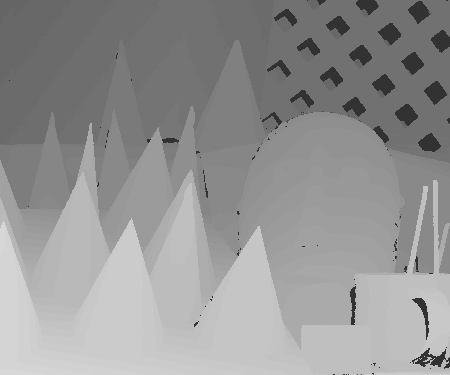
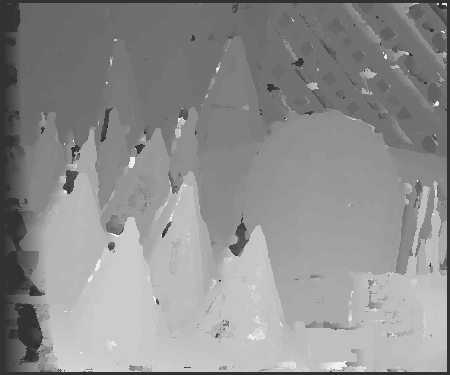

# Stereo Depth Estimation

## Introduction
This repository contains a minimal code example to estimate disparity using rectified stereo images from the Middlebury Cones dataset.
A local, fixed-support stereo correspondence algorithm is used.
Specifically, a window-based method using the sum-of-absolute-differences (SAD) similarity measure is implemented.

|  |  |
| :-----------------------------------------------: | :------------------------------------------------: |
| Left Stereo Image                                 | Right Stereo Image                                 |

|  |  |
| :------------------------------------------------------------------: | :---------------------------------------------------------------------: |
| Ground Truth Disparity                                               | Estimated Disparity                                                     |

## Installation
1) Create a conda environment and activate it.
```
conda create -n stereo python=3.9
conda activate stereo
```
2) Clone the repository
```
git clone https://github.com/ed-winning/stereo_depth_estimation.git
```
3) Install the dependencies
```
pip install -r requirements.txt
```

## Running the Code
The following code will generate and visualize the estimated disparity image shown above:
```
python main.py
```
